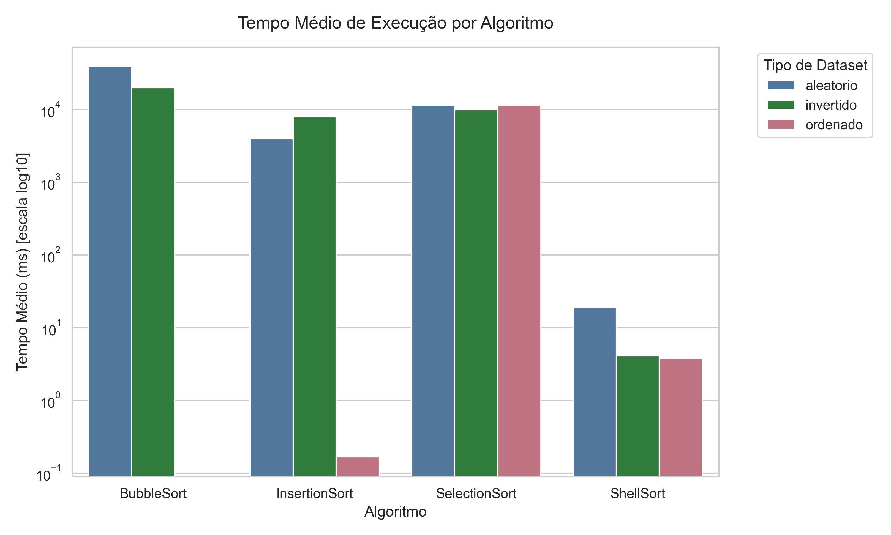
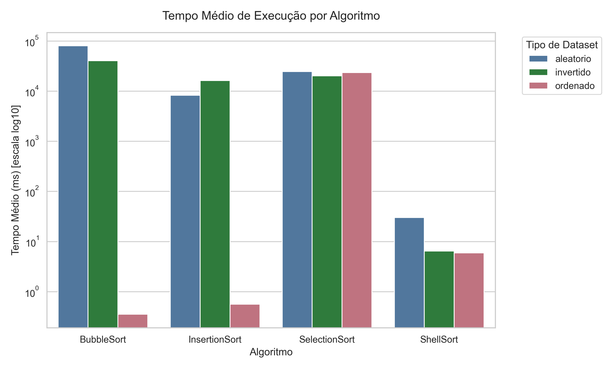
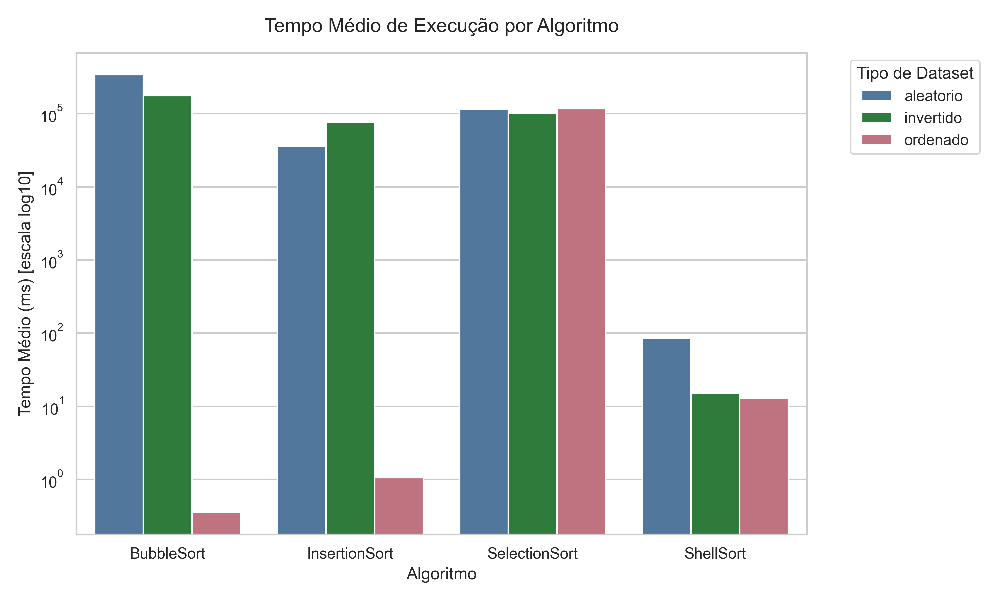

# Benchmark de Algoritmos de Ordenação — Go

Projeto de análise de desempenho de algoritmos de ordenação clássicos implementados em **Go**, com coleta de métricas instrumentadas (tempo, comparações, trocas e alocações de memória) e visualização dos resultados em Python.

---

## Algoritmos avaliados

| Algoritmo | Complexidade (pior caso) | Complexidade (melhor caso) |
|---|---|---|
| **Bubble Sort** | O(n²) | O(n) |
| **Selection Sort** | O(n²) | O(n²) |
| **Insertion Sort** | O(n²) | O(n) |
| **Shell Sort** | O(n log²n) | O(n log n) |

---

## Estrutura do projeto

```
.
├── benchmark/
│   ├── algorithms.go   # Implementações instrumentadas dos 4 algoritmos
│   ├── exporter.go     # Exportação dos resultados para CSV
│   ├── metrics.go      # Estruturas de dados e cálculo de estatísticas
│   └── runner.go       # Motor de execução e coleta de métricas
├── cmd/
│   └── benchmark/
│       └── main.go     # Ponto de entrada: executa o benchmark e gera os CSVs
├── data/
│   └── generator.go    # Gerador de datasets (ordenado, invertido, aleatório)
├── scripts/
│   └── plot_results.py # Geração de gráficos e tabelas com Python
├── output/
│   ├── benchmark_results*.csv   # Execuções individuais por tamanho
│   ├── benchmark_stats*.csv     # Estatísticas agregadas por tamanho
│   └── plots_python/            # Gráficos e tabelas gerados
│       ├── 175k/
│       ├── 250k/
│       ├── 500k/
│       └── 750k/
└── go.mod
```

---

## Como executar

### Pré-requisitos

- [Go 1.21+](https://go.dev/dl/)
- [Python 3.10+](https://www.python.org/) com as dependências abaixo

### 1. Executar o benchmark (Go)

```bash
# Ajuste o tamanho do dataset em data/generator.go → Size = <N>
go run cmd/benchmark/main.go
```

Os resultados são salvos em:
- `output/benchmark_results.csv` — uma linha por execução individual
- `output/benchmark_stats.csv` — estatísticas agregadas (min, max, média, desvio padrão, mediana)

### 2. Gerar os gráficos (Python)

```bash
# Instalar dependências
pip install pandas matplotlib seaborn dataframe-image

# Gerar visualizações
python scripts/plot_results.py
```

Os arquivos PNG são salvos em `output/plots_python/`.

---

## Métricas coletadas

Cada execução registra:

| Campo | Descrição |
|---|---|
| `Algorithm` | Nome do algoritmo |
| `DataType` | Tipo do dataset: `ordenado`, `invertido`, `aleatorio` |
| `Run` | Índice da execução (1–3) |
| `InputSize` | Número de elementos |
| `DurationNs` | Duração em nanossegundos |
| `DurationMs` | Duração em milissegundos |
| `Comparisons` | Total de comparações elemento-a-elemento |
| `Swaps` | Total de trocas realizadas |
| `MemAllocKB` | Alocações de memória durante a execução (KB) |

---

## Datasets testados

Cada tamanho é executado **3 vezes** para cada combinação algoritmo × tipo de dataset:

- **Ordenado** — melhor caso para Bubble e Insertion Sort
- **Invertido** — pior caso para todos os algoritmos O(n²)
- **Aleatório** — caso médio com seed fixa (`42`) para reprodutibilidade

Tamanhos avaliados: **175.000 · 250.000 · 500.000 · 750.000 · 1.500.000** elementos.

---

## Resultados — visão geral

### Tempo médio de execução (escala log₁₀)

Os gráficos abaixo mostram o tempo médio em milissegundos por algoritmo e tipo de dataset.

| 175k | 250k | 500k |
|:---:|:---:|:---:|
|  |  |  |

| 750k | 1.5M |
|:---:|:---:|
|  |  |

### Principais observações

- **Shell Sort** é consistentemente mais rápido em todos os cenários — até **8.000× mais rápido** que Bubble Sort no caso aleatório com 1,5M elementos.
- **Bubble Sort** e **Insertion Sort** apresentam tempo próximo de zero para dados **já ordenados** (melhor caso O(n)).
- **Selection Sort** tem comportamento O(n²) uniforme independente do tipo de dataset — faz sempre `n(n-1)/2` comparações.
- O crescimento quadrático dos algoritmos O(n²) torna-os inviáveis para grandes volumes: Bubble Sort aleatorio com 1,5M elementos levaria **~55 minutos**.

---

## Tecnologias

- **Go 1.21+** — benchmark, instrumentação e exportação CSV
- **Python 3** — visualização com `pandas`, `matplotlib`, `seaborn`, `dataframe-image`

---

## Licença

MIT
