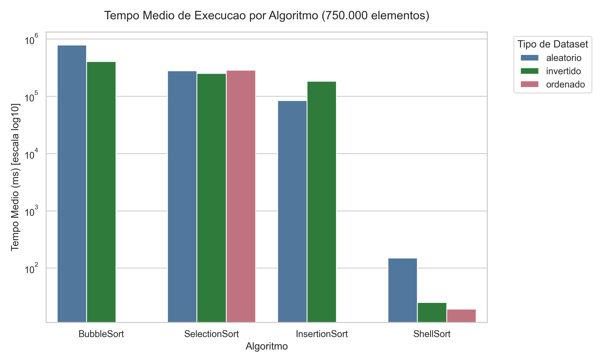
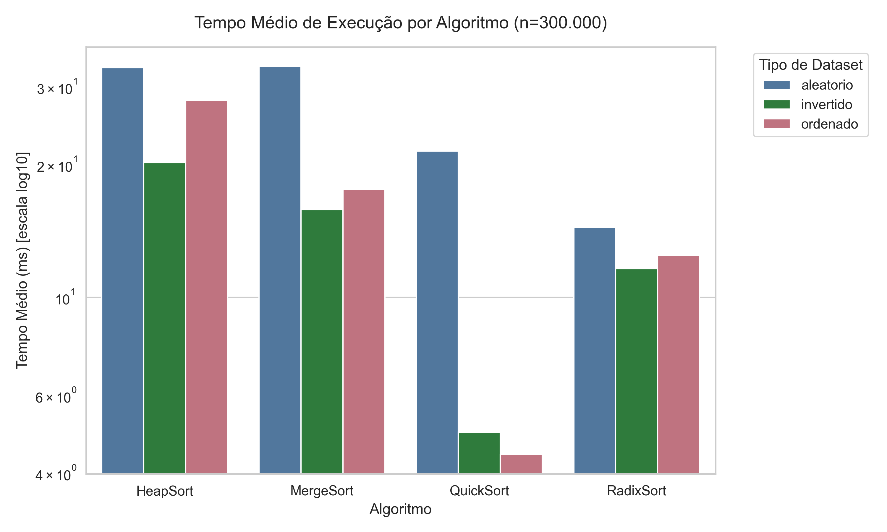
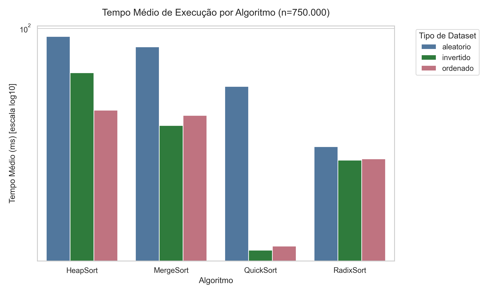
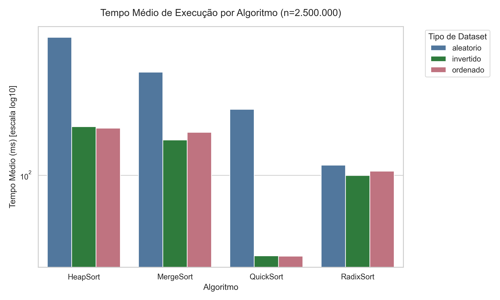

<div align="center">

# Benchmark de Algoritmos de Ordenação

### Análise Empírica e Reprodutível em Go 1.23

[](https://go.dev/)
[](LICENSE)
[]()
[](https://www.utfpr.edu.br/)

**Trabalho acadêmico** desenvolvido na disciplina de **Pesquisa e Ordenação**  
[Universidade Tecnológica Federal do Paraná — UTFPR](https://www.utfpr.edu.br/)

**Autor:** Gustavo R. Mazur · `gustamomazur@alunos.utfpr.edu.br`

</div>

---

## Sobre o Projeto

Este repositório contém uma **infraestrutura de benchmarking científico** para análise empírica de algoritmos de ordenação clássicos. A abordagem é experimental e reprodutível: cada algoritmo é instrumentado com contagem exata de comparações e movimentações de elementos, executado em múltiplos tamanhos de entrada e tipos de dataset, e os resultados são exportados para análise estatística e geração de gráficos.

O projeto foi desenvolvido em **duas fases**, cada uma resultando em um artigo científico no formato [SBC (Sociedade Brasileira de Computação)](https://www.sbc.org.br/):

| Fase | Algoritmos | Artigo |
|:---:|---|:---:|
| 1 | Bubble Sort, Selection Sort, Insertion Sort, Shell Sort | [📄 Ver PDF](artigo-bubble/artigo.pdf) |
| 2 | Quick Sort, Merge Sort, Heap Sort, Radix Sort | [📄 Ver PDF](artigo-qmhr/artigo.pdf) |

---

## Artigos Científicos

### Artigo 1 — Algoritmos O(n²)

> **"Análise Empírica de Algoritmos de Ordenação: Uma Avaliação Experimental de Bubble Sort, Selection Sort, Insertion Sort e Shell Sort em Entradas de Grande Volume"**

[**→ Leia o artigo completo (PDF)**](artigo-bubble/artigo.pdf)

**Principais achados:**
- Bubble Sort e Insertion Sort atingem tempo ≈ 0 ms para entradas ordenadas (melhor caso O(n) confirmado)
- Selection Sort mantém comportamento uniforme independente da distribuição de entrada — ausência de melhor caso em comparações
- Shell Sort supera os demais algoritmos O(n²) em até **8.000×** para n = 1.500.000 elementos aleatórios
- A diferença de classe de complexidade é o fator dominante em grande escala

---

### Artigo 2 — Algoritmos O(n log n) e Não-Comparativo

> **"Análise Empírica de Algoritmos de Ordenação: Uma Avaliação Experimental de Quick Sort, Merge Sort, Heap Sort e Radix Sort em Entradas de Grande Volume"**

[**→ Leia o artigo completo (PDF)**](artigo-qmhr/artigo.pdf)

**Principais achados:**
- Radix Sort é o algoritmo mais rápido em todos os cenários — **111 ms para 2.500.000 elementos**, contornando o limite inferior Ω(n log n)
- Quick Sort com pivô mediana-de-três é **4,8× mais rápido** em entradas ordenadas do que em aleatórias — comportamento contra-intuitivo explicado pelo particionamento perfeito
- Heap Sort sofre penalidade de **2,1×** em relação ao Quick Sort (n = 2.500.000) apesar da mesma classe assintótica, devido à baixa localidade de cache
- Merge Sort apresenta o menor desvio padrão de todos: **0,14 ms** para n = 1.000.000 aleatório

---

## Algoritmos Implementados

### Fase 1 — O(n²)

| Algoritmo | Pior caso | Caso médio | Melhor caso | Espaço |
|---|:---:|:---:|:---:|:---:|
| **Bubble Sort** | O(n²) | O(n²) | **O(n)** | O(1) |
| **Selection Sort** | O(n²) | O(n²) | O(n²) | O(1) |
| **Insertion Sort** | O(n²) | O(n²) | **O(n)** | O(1) |
| **Shell Sort** | O(n log²n) | O(n log²n) | O(n log n) | O(1) |

### Fase 2 — O(n log n) e Não-Comparativo

| Algoritmo | Pior caso | Caso médio | Melhor caso | Espaço | Estável |
|---|:---:|:---:|:---:|:---:|:---:|
| **Quick Sort** | O(n²)† | **O(n log n)** | O(n log n) | O(log n) | ❌ |
| **Merge Sort** | O(n log n) | O(n log n) | O(n log n) | **O(n)** | ✅ |
| **Heap Sort** | O(n log n) | O(n log n) | O(n log n) | O(1) | ❌ |
| **Radix Sort** | O(nk) | O(nk) | O(nk) | O(n+k) | ✅ |

> † Quick Sort com seleção de pivô pela **mediana de três** — mitiga o pior caso em entradas ordenadas/invertidas.

---

## Resultados

### Fase 1 — Tempo médio de execução (escala log₁₀)

| n = 750.000 elementos | n = 1.500.000 elementos |
|:---:|:---:|
|  |  |

> 🔵 aleatório · 🟢 invertido · 🌸 ordenado

**Destaque — Shell Sort vs algoritmos O(n²) (n = 750.000, aleatório):**

| Algoritmo | Tempo médio (ms) | vs Shell Sort |
|---|---:|:---:|
| Bubble Sort | 785.339 | 5.213× mais lento |
| Selection Sort | 279.641 | 1.859× mais lento |
| Insertion Sort | 84.355 | 561× mais lento |
| **Shell Sort** | **150** | — |

---

### Fase 2 — Tempo médio de execução (escala log₁₀)

| n = 300.000 elementos | n = 750.000 elementos |
|:---:|:---:|
|  |  |

| n = 2.500.000 elementos |
|:---:|
|  |

> 🔵 aleatório · 🟢 invertido · 🌸 ordenado

**Tempo médio de execução (ms) — todos os tamanhos:**

| Algoritmo | Dataset | 300k | 450k | 750k | 1M | 2,5M |
|---|---|---:|---:|---:|---:|---:|
| Quick Sort | ordenado | 4,4 | 7,5 | 11,6 | 15,8 | 42,6 |
| Quick Sort | invertido | 4,9 | 7,6 | 11,2 | 16,4 | 42,7 |
| Quick Sort | aleatório | 21,5 | 32,5 | 56,3 | 75,8 | 200,9 |
| Merge Sort | ordenado | 17,6 | 25,2 | 42,3 | 55,8 | 157,6 |
| Merge Sort | invertido | 15,8 | 23,7 | 38,3 | 52,7 | 145,4 |
| Merge Sort | aleatório | 33,4 | 50,5 | 83,3 | 112,4 | 297,7 |
| Heap Sort | ordenado | 27,9 | 28,6 | 44,5 | 61,5 | 164,8 |
| Heap Sort | invertido | 20,2 | 31,8 | 64,5 | 70,0 | 167,3 |
| Heap Sort | aleatório | 33,2 | 50,0 | 92,3 | 126,8 | 430,2 |
| **Radix Sort** | **ordenado** | **12,4** | **16,4** | **27,5** | **43,1** | **104,5** |
| **Radix Sort** | **invertido** | **11,6** | **17,1** | **27,2** | **40,5** | **99,8** |
| **Radix Sort** | **aleatório** | **14,4** | **19,5** | **31,1** | **47,3** | **111,4** |

---

## Metodologia Experimental

### Design do experimento

Cada combinação `(algoritmo × tipo de dataset × tamanho)` é executada **3 vezes** independentes:

1. **Cópia limpa de dados** — cada run recebe uma cópia isolada do dataset original
2. **Limpeza do GC** — duas chamadas `runtime.GC()` antes de cada medição eliminam ruído de coletas anteriores
3. **Relógio monotônico** — `time.Since(start)` com resolução de nanossegundos, sem I/O entre as marcas de tempo
4. **Seed fixa** — `rand.NewSource(42)` garante datasets aleatórios idênticos em qualquer máquina

### Tipos de dataset

| Tipo | Descrição | Caso teórico |
|---|---|---|
| `ordenado` | `[1, 2, 3, ..., n]` | Melhor caso para Bubble, Insertion, Quick (pivô mediana) |
| `invertido` | `[n, n-1, ..., 1]` | Pior caso para Bubble, Insertion (sem pivô otimizado) |
| `aleatório` | Permutação com seed fixa 42 | Caso médio |

### Ambiente de hardware

| Componente | Especificação |
|---|---|
| Modelo | Dell G15 5515 |
| Processador | AMD Ryzen 5 5600H, 3,3 GHz, 6 núcleos / 12 threads |
| Arquitetura | x86-64 |
| Memória RAM | 16 GB DDR4 |
| Sistema Operacional | Windows 11 Home (Build 26200) |
| Linguagem | Go 1.23 (compilação nativa, sem JIT) |

---

## Estrutura do Repositório

```
.
├── benchmark/
│   ├── algorithms.go   # 8 algoritmos instrumentados (interface SortAlgorithm)
│   ├── exporter.go     # Exportação de resultados e estatísticas para CSV
│   ├── metrics.go      # Structs Result e Stats; cálculo de estatísticas
│   └── runner.go       # Motor de benchmarking (isolamento, medição, GC)
│
├── cmd/
│   └── benchmark/
│       └── main.go     # Ponto de entrada interativo (escolha de algoritmos e tamanho)
│
├── data/
│   └── generator.go    # Geração de datasets (ordenado, invertido, aleatório)
│
├── scripts/
│   └── plot_results.py # Gráficos e tabelas com matplotlib / seaborn
│
├── output/
│   └── plots_python/
│       ├── 300000/     # py_tempo_medio.png | benchmark_stats/results CSVs
│       ├── 450000/
│       ├── 750000/
│       ├── 1000000/
│       └── 2500000/
│
├── artigo-bubble/
│   ├── artigo.tex      # Artigo SBC — Fase 1 (O(n²))
│   ├── artigo.pdf      # PDF compilado
│   └── referencias.bib
│
├── artigo-qmhr/
│   ├── artigo.tex      # Artigo SBC — Fase 2 (O(n log n) + Radix)
│   ├── artigo.pdf      # PDF compilado
│   └── referencias.bib
│
├── go.mod
└── README.md
```

---

## Por que Go?

| Critério | Go | Python | Java | C/C++ |
|---|:---:|:---:|:---:|:---:|
| Compilado para código nativo | ✅ | ❌ | ❌ JVM | ✅ |
| Controle explícito do GC | ✅ | ❌ | Parcial | N/A |
| Sem JIT warm-up | ✅ | ✅ | ❌ | ✅ |
| Desenvolvimento rápido | ✅ | ✅ | ❌ | ❌ |
| Medição de memória heap nativa | ✅ | Parcial | Parcial | ❌ |

Go oferece o equilíbrio ideal entre **precisão de medição** (próxima de C) e **produtividade de desenvolvimento** (próxima de Python) — sem artefatos de JIT, sem overhead de interpretação.

---

## Como Executar

### Pré-requisitos

- [Go 1.21+](https://go.dev/dl/) — verificar com `go version`
- Python 3.10+ com pip — para os gráficos

### 1. Clonar o repositório

```bash
git clone https://github.com/GUSTAVOHOOO/Algoritmo-de-ordena-o.git
cd "Algoritmo-de-ordena-o"
```

### 2. Executar o benchmark

```bash
go run cmd/benchmark/main.go
```

O programa solicita interativamente o tamanho do dataset e os algoritmos a executar:

```
╔══════════════════════════════════════════════════════╗
║     Benchmark de Algoritmos de Ordenação — Go        ║
╚══════════════════════════════════════════════════════╝

▶ Digite o número de elementos para o dataset (padrão: 300000): 750000

▶ Selecione os algoritmos para rodar:
   0 - TODOS
   1 - BubbleSort
   2 - SelectionSort
   3 - InsertionSort
   4 - ShellSort
   5 - MergeSort
   6 - QuickSort
   7 - HeapSort
   8 - RadixSort
  Escolha (ex: 0, ou '5,6,7,8') [padrão: 0]: 5,6,7,8
```

> ⚠️ **Atenção:** algoritmos O(n²) (Bubble, Selection, Insertion) com entradas ≥ 500.000 elementos podem levar **vários minutos** por execução.

### 3. Gerar gráficos e tabelas

```bash
# Criar e ativar ambiente virtual (recomendado)
python -m venv .venv
.venv\Scripts\activate          # Windows
source .venv/bin/activate       # Linux / macOS

pip install pandas matplotlib seaborn dataframe-image

python scripts/plot_results.py
```

Os arquivos são salvos em `output/plots_python/<tamanho>/`:

| Arquivo | Descrição |
|---|---|
| `py_tempo_medio.png` | Gráfico de barras agrupado com escala log₁₀ |
| `py_tabela_resultados.png` | Tabela de estatísticas: min, max, média, desvio padrão |
| `py_tabela_completa.png` | Tabela com todas as execuções individuais |

---

## Métricas Coletadas

| Campo | Tipo | Descrição |
|---|---|---|
| `Algorithm` | string | Nome do algoritmo |
| `DataType` | string | Tipo do dataset: `ordenado`, `invertido`, `aleatorio` |
| `Run` | int | Índice da execução (1, 2 ou 3) |
| `InputSize` | int | Número de elementos |
| `DurationNs` | int64 | Duração em nanossegundos |
| `DurationMs` | float64 | Duração em milissegundos |
| `Comparisons` | int64 | Total de comparações elemento-a-elemento |
| `Swaps` | int64 | Movimentações de elementos (trocas, deslocamentos ou distribuições) |
| `MemAllocKB` | float64 | Alocações cumulativas de heap durante a execução (KB) |

---

## Adicionando Novos Algoritmos

O projeto foi projetado para receber novos algoritmos **sem modificar nenhum arquivo existente**, exceto `main.go`:

**Passo 1** — Implementar em `benchmark/algorithms.go`:

```go
type TimSorter struct{}

func (TimSorter) Name() string { return "TimSort" }

func (TimSorter) Sort(arr []int) SortResult {
    var cmp, swaps int64
    // ... implementação com contagem de cmp e swaps
    return SortResult{arr, cmp, swaps}
}
```

**Passo 2** — Registrar em `cmd/benchmark/main.go`:

```go
allAlgorithms := []benchmark.SortAlgorithm{
    // algoritmos existentes ...
    benchmark.TimSorter{},  // ← adicionar aqui
}
```

O runner, o exporter e o script Python processam qualquer algoritmo automaticamente.

---

## Tech Stack

| Camada | Tecnologia | Papel |
|---|---|---|
| Benchmark | Go 1.23 | Implementação, instrumentação e medição |
| Visualização | Python 3.10+ | Gráficos e tabelas estatísticas |
| Gráficos | matplotlib + seaborn | Barplots com escala logarítmica |
| Tabelas | dataframe-image | Exportação de DataFrames para PNG |
| Dados | pandas | Leitura e agregação de CSVs |
| Artigos | LaTeX + SBC template | Publicação científica |

---

## Instituição

**Universidade Tecnológica Federal do Paraná — UTFPR**  
Disciplina: Pesquisa e Ordenação  
Autor: Gustavo R. Mazur — `gustamomazur@alunos.utfpr.edu.br`

---

## Licença

[MIT](LICENSE)
